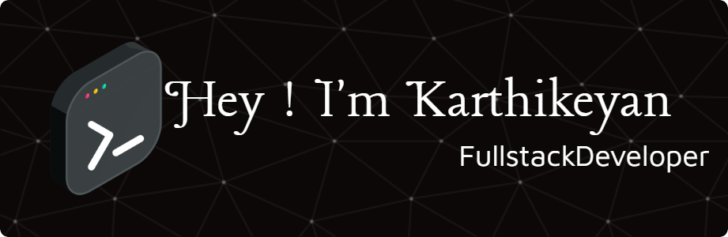

  

  

<h1 align="center">
  Let's Connect and have a Chat!💬
</h1>

## 👨‍💻 About Me

I'm a passionate and innovative developer specializing in **Java**, **Spring Boot**, and the **MERN Stack**. 🚀  
I thrive on solving **real-world problems** and crafting **user-centric solutions** that make a difference. Whether it’s **building scalable web apps**, **optimizing performance**, or **enhancing user experiences**, I’m always excited to dive into new challenges.

I’m also a **competitive programmer**, constantly improving my problem-solving skills and participating in coding contests on platforms like **Codeforces**, **LeetCode**, and **HackerRank**. 💻

## 👨‍💻 Competitive Programming

I’m a passionate **competitive programmer** with a focus on solving challenging problems and constantly improving my skills through platforms like **LeetCode**, **Codeforces**, **HackerRank**, and **CodeChef**.

### 🏆 My Coding Profiles

  
  
  
  

 

### 🌟 GitHub Profile

  

 

## 💼 Experience
 

### 🧑‍🎨 Creator — Cod.e.cafe  
Shared 50+ web templates & coding resources on Instagram — nurturing a strong tech community.

### 🔬 Research Associate — *Igen*  
Worked on Sustainable Development Goals (SDGs) with a tech-driven mindset.

<h2 align="center" style="color: #10B981;">
  
  Tools
</h2>

  
  
  
  

<h2 align="center" style="color: #3B82F6;">
  
  Languages
</h2>

  
  
  
  
  
  
  

<h2 align="center" style="color:rgb(185, 185, 16);">🧩 Frameworks</h2>

  
  
  

<h2 align="center" style="color:rgb(230, 55, 55);">📚 Libraries & Databases</h2>

  
  
  
  
  

### 🌟 Additional Highlights
-  Always exploring **emerging technologies** and keen on **continuous learning**

 -  Fluent in **English** & **Tamil**, with a basic understanding of **German**  
 - Collaborative, problem-solving mindset, ready for new opportunities to grow

  

